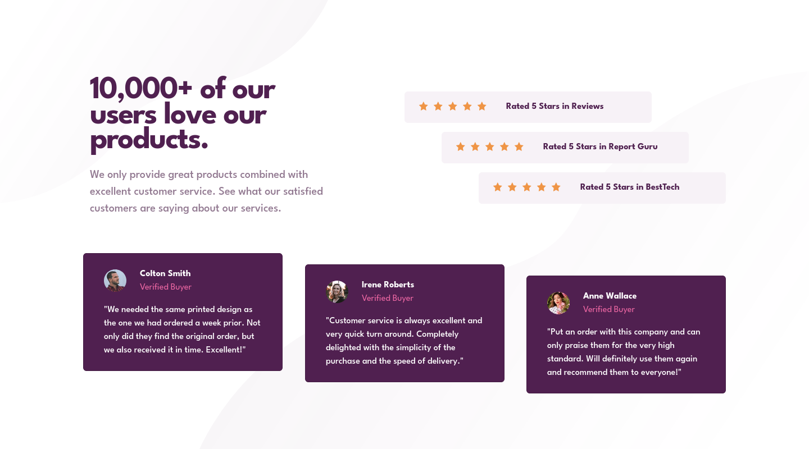

# Frontend Mentor - Social proof section solution

This is a solution to the [Social proof section challenge on Frontend Mentor](https://www.frontendmentor.io/challenges/social-proof-section-6e0qTv_bA). Frontend Mentor challenges help you improve your coding skills by building realistic projects.

## Table of contents

- [Overview](#overview)
  - [The challenge](#the-challenge)
  - [Screenshot](#screenshot)
  - [Links](#links)
- [My process](#my-process)
  - [Built with](#built-with)
- [Author](#author)

### Screenshot

|Mobile|Desktop|
|---|---|
|||

### Links

- Solution URL: [Add solution URL here](https://github.com/chegx/social-proof-section-bs)
- Live Site URL: [Add live site URL here](https://chegx.github.io/social-proof-section-bs/)

## My process

### Built with

- Bootstrap
- CSS custom properties

## Author

- Frontend Mentor - [@chegx](https://www.frontendmentor.io/profile/chegx)
